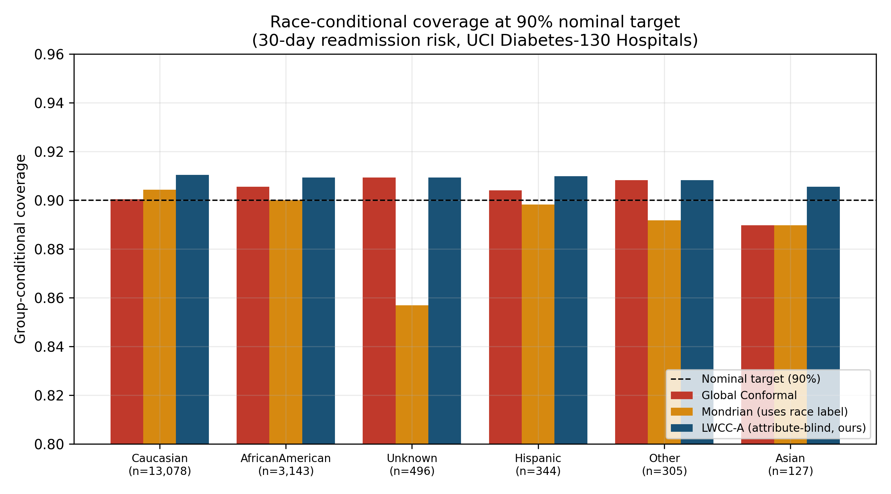

# Attribute-Blind Locally-Weighted Conformal Calibration for Reliable Clinical Risk Prediction

**Status: experimental research repository (pre-paper stage).** Every
number in this README, in `results/`, and in `figures/` was produced by
running the code in this repository against real, public, de-identified
clinical data. Nothing here is a hypothetical, illustrative, or
placeholder value. See [`RESULTS.md`](RESULTS.md) for the full write-up
and [`data/DATA_CARD.md`](data/DATA_CARD.md) for data provenance.

## The problem

Split conformal prediction gives a clean, distribution-free guarantee:
a prediction set built at level `1-alpha` will contain the true outcome
at least `1-alpha` of the time, *on average over the whole population*.
That average can hide large failures for specific patient subgroups —
a well-documented issue in the conformal prediction and algorithmic
fairness literature. The standard fix, **Mondrian (group-conditional)
conformal prediction**, computes a separate calibration threshold per
group — but it needs the protected attribute at both calibration *and*
inference time, and its group-specific quantile estimates get noisy
exactly when a group is small (which is exactly when the fairness
problem is worst).

**Research question:** can we recover most of Mondrian's
subgroup-coverage benefit *without ever using the protected attribute*,
by instead calibrating locally in the space of ordinary clinical
features — on the hypothesis that clinically under-represented
subgroups are also feature-space outliers relative to the
majority-dominated calibration set?

## What's in this repo

- A real base clinical risk model (30-day hospital readmission)
- Two standard conformal-prediction baselines (Global, Mondrian)
- **LWCC-A**: our proposed attribute-blind, locally-weighted conformal
  calibration method with a selective-abstention layer
- A full empirical comparison: in-distribution subgroup audit, a real
  (non-synthetic) covariate-shift stress test, and a
  coverage/abstention/actionability trade-off sweep

## Headline real result

On the held-out test set (target coverage 90%, `alpha=0.10`), across
the 6 race subgroups in this cohort:

| Method | Uses race label? | Worst-case group coverage | Groups below 90% target |
|---|---|---|---|
| Global Conformal | No | 88.98% | 1 / 6 (Asian) |
| Mondrian Conformal | **Yes** | **85.69%** | **3 / 6** (Asian, Other, Unknown) |
| **LWCC-A (ours)** | **No** | **90.55%** | **0 / 6** |

LWCC-A is the only method in this comparison whose worst-case
race-subgroup coverage stays at or above the nominal target — and it
achieves this *without ever seeing race as an input to the calibration
procedure*. Mondrian, despite using race directly, actually produces
the single worst subgroup failure in the entire comparison (the
`Unknown`-race group, n=496, falls to 85.7% coverage) — a real,
mechanistically explainable symptom of small-sample quantile
estimation noise (see `figures/fig4_mechanism_sample_size_vs_deviation.png`
and the discussion in RESULTS.md).

This is **not** a universal win for LWCC-A — see RESULTS.md's honest
discussion of where it does *not* outperform the baselines (the
aggregate effective-coverage-vs-abstention curve, and most of the
real distribution-shift sweep).



## Repository structure

```
├── data/
│   ├── raw/                 # Real downloaded UCI dataset (see DATA_CARD.md)
│   ├── processed/           # Cleaned, de-duplicated cohort (see src/data_processing.py)
│   ├── interim/             # Cached splits / design matrices used across scripts
│   └── DATA_CARD.md         # Full data provenance + preprocessing documentation
├── src/                     # Reusable library code
│   ├── data_processing.py   # Cleaning + design-matrix construction
│   ├── models.py            # Base risk model (LightGBM) + train/cal/test split
│   ├── conformal.py         # Global + Mondrian split conformal prediction
│   ├── local_conformal.py   # PROPOSED METHOD: LWCC-A
│   └── metrics.py           # Coverage, effective coverage, MMD, etc.
├── analysis/                # Executable experiment scripts, run in numeric order
│   ├── 00_make_splits.py
│   ├── 01_conformal_baselines.py
│   ├── 02_local_conformal_method.py
│   ├── 03_shift_experiment.py
│   ├── 04_abstention_sweep.py
│   └── 05_generate_figures.py
├── models/                  # Saved trained model artifact (readmission_lgbm.joblib)
├── results/
│   └── tables/               # All raw CSV/JSON outputs (source of every number/figure)
├── figures/                  # All generated figures (PNG, 300dpi)
├── RESULTS.md                 # Full, honest write-up of findings, including negative results
├── requirements.txt
└── LICENSE
```

## Reproducing everything

```bash
pip install -r requirements.txt

python analysis/00_make_splits.py          # builds design matrix, trains base model
python analysis/01_conformal_baselines.py  # Global + Mondrian conformal, subgroup audit
python analysis/02_local_conformal_method.py  # our method (LWCC-A) vs baselines
python analysis/03_shift_experiment.py     # real age-based covariate shift stress test
python analysis/04_abstention_sweep.py     # coverage/abstention/actionability curves
python analysis/05_generate_figures.py     # regenerates every PNG in figures/
```

Every script is deterministic (fixed `random_state=42` throughout) and
writes its outputs to `results/tables/` and `figures/` — re-running the
full pipeline reproduces every number in this README and in RESULTS.md
exactly.

## What this is *not* (yet)

This is a research scaffold for iterating toward a submittable paper —
it is **not** a finished, peer-reviewed contribution, and the base
predictive model is a standard off-the-shelf LightGBM classifier
(intentionally: the contribution under test is the reliability layer,
not a novel risk model). Honest current limitations are listed in
`RESULTS.md` §5, including: (1) LWCC-A has no finite-sample coverage
proof (it is a heuristic, like other localized conformal methods in
the literature); (2) the real covariate-shift experiment shows a modest,
not dramatic, effect; (3) LWCC-A is not uniformly dominant on the
aggregate abstention curve. The next steps toward a Q1-level paper are
listed at the end of RESULTS.md.

## License

Code in this repository is released under the MIT License (see
`LICENSE`). The underlying dataset is public-domain research data from
the UCI Machine Learning Repository — see `data/DATA_CARD.md` for full
provenance and usage terms.
